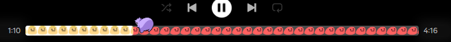
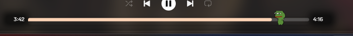
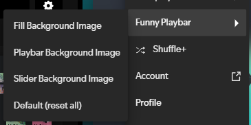

# Funny PlayBar 🎵

Customize your Spotify playbar using images.




## Usage

Open the settings menu from the top-right corner.

Available options:
- **Fill Background Image** – fills the entire progress background with an image  
- **Playbar Background Image** – sets a custom background for the playbar  
- **Slider Background Image** – sets a background image for the progress slider  
- **Default (reset all)** – restores the playbar to its original state  

### Recomendations
Use an image with a 1:1 aspect ratio (e.g. 32×32)



## Installation

### Install via Spicetify Marketplace
The easiest way: install directly from the **Spicetify Marketplace**.

### Manual installation

1. Copy `funny-playbar.js` (from the `dist` folder) into the Spicetify extensions folder:

| Platform        | Path |
|-----------------|------|
| macOS / Linux  | `~/.config/spicetify/Extensions` |
| Windows        | `%appdata%/spicetify/Extensions/` |

2. Run the following commands:

```bash
spicetify config extensions autoplay.js
spicetify apply
```
## Feedback

If you find bugs, have suggestions, or new ideas, feel free to open an issue on the repository.

## Contributing

Contributions are always welcome!
Feel free to fork the project and submit a pull request.

## Authors

- [@revenbot](https://github.com/RevenBot)

## Credits

Thanks to the creator of the Nyan Cat Playback Progress Bar snippet for showing me the way 🚀
